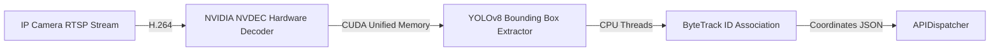

# PurpleInsight: Enterprise Deployment & Scale-Out Manual
## Edge Hardware Provisioning, CCTV Calibration, Security Boundaries, & Cloud Clustering

This guide details the technical steps to configure, secure, deploy, and scale the **PurpleInsight AI Store Intelligence System** in a high-density, multi-store enterprise production environment.

---

## 1. Store Edge Setup & RTSP Camera Ingestion

The store edge environment requires local computing nodes near IP cameras to perform real-time video decoding, deep learning detection (YOLOv8), and ByteTrack tracking.

### Hardware Prerequisites (Per Store, Up to 16 Cameras)
*   **Edge Compute**: NVIDIA Jetson AGX Orin (64GB) or local industrial server with NVIDIA RTX 4060 GPU (8GB VRAM minimum).
*   **OS**: Ubuntu 22.04 LTS with NVIDIA JetPack 6.0+ or NVIDIA CUDA Driver 12.2+.
*   **Frameworks**: Docker Engine with NVIDIA Container Toolkit enabled for CUDA passthrough.

### RTSP Ingestion Pipeline
Edge devices decode H.264/H.265 RTSP streams from IP cameras.

For zero-lag frame acquisition, the `edge/src/detector.py` module runs a dedicated background grabbing thread, immediately discarding old frames if processing latency spikes.

### Camera Perspective Projection (Homography Calibration)
To map raw camera pixels $(u, v)$ to absolute 2D store coordinates $(x, y)$ in meters, administrators perform camera calibration:
1.  **Coordinate Mapping**: Place four physical markers on the store floor forming a rectangle.
2.  **Measurements**: Measure the actual distance in meters (e.g. $4\text{m} \times 2\text{m}$).
3.  **Pixel Coordinates**: Record the $(u, v)$ pixel coordinates of the four points from the camera image.
4.  **Matrix Calculation**: Solve for the $3 \times 3$ homography projection matrix ($H$) using OpenCV's `getPerspectiveTransform`:
    $$\begin{bmatrix} x \\ y \\ w \end{bmatrix} = H \begin{bmatrix} u \\ v \\ 1 \end{bmatrix}$$
5.  **Configuration**: Populate `edge/config/pipeline_config.yaml` with the homography matrix values for each camera profile.

---

## 2. System Security Boundaries

All data streams are hardened to prevent unauthorized spoofing or eavesdropping.

```text
+-------------------+              mTLS / HTTPS POST              +---------------------+
|  Store Edge Node  | ==========================================> |  Central API Gateway|
|  (Anonymous JSON) |                                             |  (Rate Limiting)    |
+-------------------+                                             +---------------------+
                                                                             ||
                                                                   JWT Token Verification
                                                                             ||
                                                                             \/
                                                                  +---------------------+
                                                                  |  FastAPI Backend    |
                                                                  +---------------------+
```

### A. Mutual TLS (mTLS) Ingestion
Edge nodes stream telemetry to central backend endpoints. All connections must go through an **Nginx/Envoy API Gateway** enforcing mTLS:
*   Only edge containers pre-provisioned with valid cryptographic store certificates can establish a TLS session.
*   Prevents external attackers from injection spoofed telemetry events or occupancy statistics.

### B. Ingestion Access Control & JWT Signature
All edge telemetry POST requests must contain short-lived cryptographically signed **JSON Web Tokens (JWT)**:
*   Edge nodes retrieve JWTs by authenticating with their unique `store_id` and secret API keys.
*   FASTAPI validates tokens locally via symmetric HMAC-SHA256 signatures, ensuring negligible authorization latency.

### C. Rate Limiting Middleware
To prevent API denial-of-service, a sliding-window rate limiter is pre-mounted inside the backend (`backend/middleware/rate_limit.py`):
*   Limits requests per IP address (defaults to 120 requests/minute).
*   Returns an immediate `429 Too Many Requests` status in our standard JSON error payload format, conserving backend CPU cycles.

---

## 3. Central Cloud Scale-Out & Clustering

For global multi-store retail deployments, the backend is scaled out inside cloud environments (AWS, GCP, or Azure).

### A. API Layer Scaling (Kubernetes)
*   **FastAPI Deployment**: Packaged behind a **Gunicorn** process manager running multiple **Uvicorn** ASGI workers per pod:
    ```bash
    gunicorn backend.main:app -w 4 -k uvicorn.workers.UvicornWorker --bind 0.0.0.0:8000
    ```
*   **Horizontal Pod Autoscaling (HPA)**: Scaled dynamically using Kubernetes HPA based on CPU and Request-Per-Second metrics, handling peak holiday shopping traffic seamlessly.

### B. High-Throughput Buffering (Apache Kafka)
In large deployments, edge telemetry is not written directly to PostgreSQL. Instead:
1.  **Ingress Broker**: The API gateway writes raw telemetry directly into an **Apache Kafka** cluster.
2.  **Async Consumer**: A dedicated worker pool consumes the Kafka streams, executes the stateful dwell engines and spatial correlation matcher, and writes batch inserts into the database.
3.  **Benefit**: Prevents write-lock contention and absorbs high ingestion spikes without degrading query response times for managers.

### C. Database Partitioning (TimescaleDB)
As dwell logs and spatial traces accumulate to millions of rows weekly:
*   We partition tables chronologically (TimescaleDB hyper-tables) based on the `timestamp`/`entered_at` column.
*   Enables rapid query execution over recent data and supports automated, zero-downtime compression/archiving of historical retail traces.
